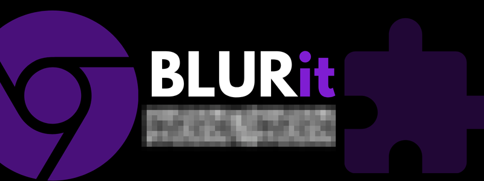
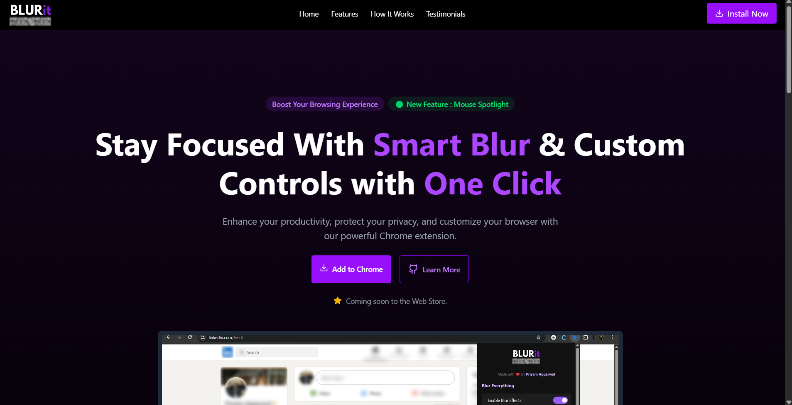
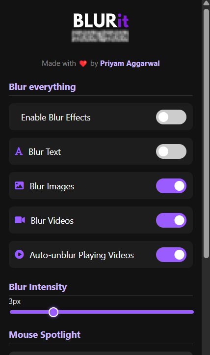

  

    
    
    
    

 

# BLURit

**BLURit** is a powerful and intuitive Chrome extension built to protect your on-screen privacy in any situation. Whether you're collaborating in a bustling open workspace, screen sharing during a live meeting, or simply working from a public space like a café or library, BLURit helps you stay in control of what others see.

 

  
  

 

## 🧩 How to Install BLURit Extension

Since **BLURit** is not listed on any browser extension store yet, you can manually install it in your web browser with the steps below:

1. **Visit the Official Website:**
   - Head over to the [BLURit Website](https://blurit.vercel.app/) to access the latest version of the extension.

2. **Download the ZIP File:**
   - On the website, click on the **"Add to Browser"** or **"Download Extension"** button to download the `.zip` file.

3. **Extract the ZIP File:**
   - Once downloaded, unzip or extract the contents to a folder on your device.

4. **Load the Extension into Your Web Browser:**
   - Open your browser’s **Extensions Manager** or **Developer Tools** page (e.g., `chrome://extensions/`, `edge://extensions/`, or similar for your browser).
   - Enable **Developer Mode** or **Load Unpacked Extension**.
   - Click **Load unpacked** (or the equivalent in your browser).
   - Select the folder where you extracted the extension files.

5. **You're Ready to Use BLURit!**
   - The extension will now appear in your browser's extensions list.
   - Pin it for easier access and enjoy blur and spotlight controls for focused, private browsing.

> 🛡️ Whether you're working in a shared office, studying in a library, or presenting your screen to a group — **BLURit** gives you complete control over what stays visible.

 

## 🔧 Extension Workflow Overview

Understanding how **BLURit** works under the hood can help you appreciate the privacy-first design and efficient performance.

The core of any browser extension is the `manifest.json` file — it serves as the configuration blueprint. Here's a breakdown of how everything fits together:

- The `manifest.json` file defines essential metadata like extension name, version, permissions, and background scripts.
- When the user activates the extension, a `content.js` script is injected into the webpage to apply dynamic styles such as blur and spotlight effects.
- The popup interface interacts with the extension’s background processes to read and update user settings in real-time.
- All the customization settings (like blur level, spotlight toggle, etc.) are stored using `chrome.storage`, making them persistent across sessions.
- The entire extension is isolated from the page content, ensuring security and performance.

  

# 

  
  <h3 align="left">Maintained By - Priyam Aggarwal (https://github.com/priyamaggarwal18)</h3>
    &nbsp&nbsp;
  &nbsp&nbsp;

